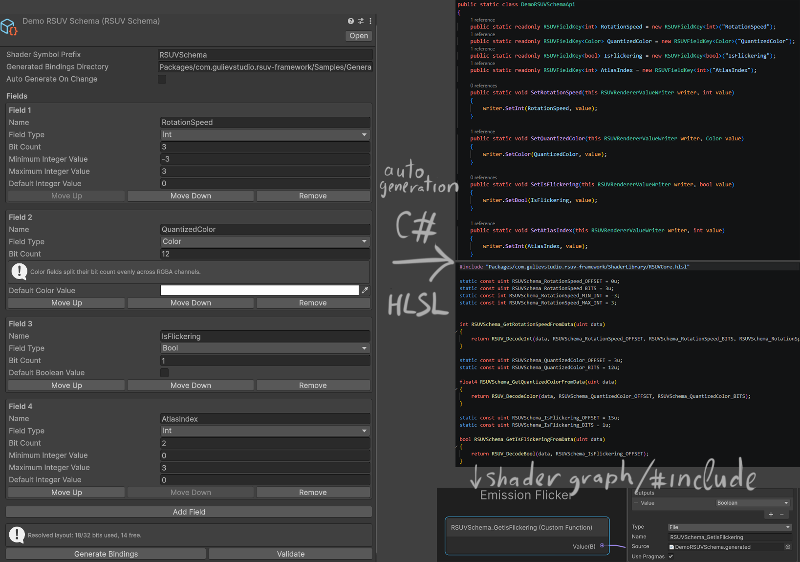
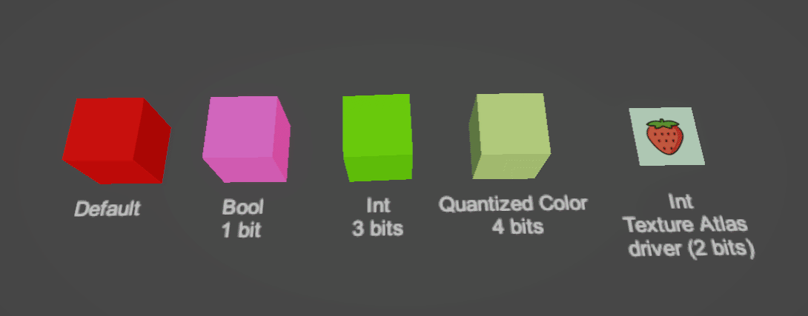
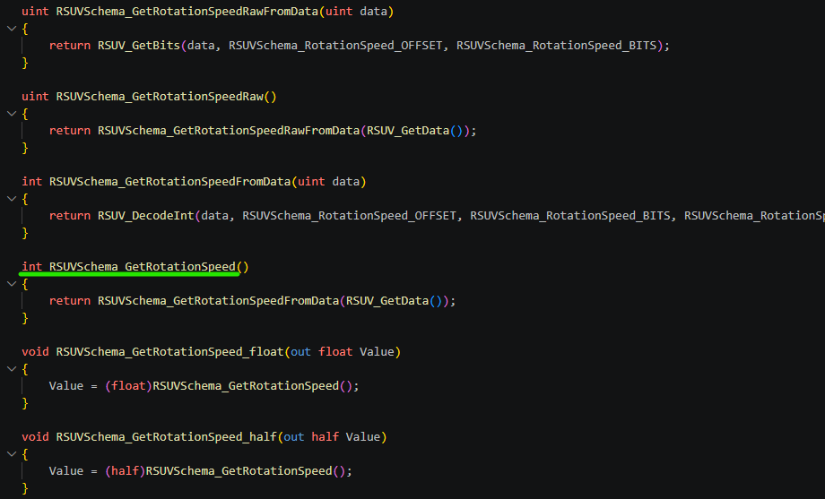

# RSUV Framework

Schema-driven wrappers for Unity 6 Renderer Shader User Value.

This package helps author, validate, pack, and decode a single 32-bit RSUV payload without manually tracking bit offsets in C# and shaders.



## Features

- `RSUVSchema` assets for authoring per-renderer packed layouts.
- Automatic packing in field order within the 32-bit budget.
- Simplified field model: `Bool`, `Int`, `Float`, `Color`.
- Runtime writer component for applying packed values to renderers.
- Inspector support for editing schema-backed values directly on components.
- Generated HLSL wrappers for handwritten shaders and Shader Graph custom function nodes.
- Generated C# bindings with typed field keys and extension-style setters.

## Installation

### Option 1

Requires GIT installation.

Window > Package Manager > + > Add package from git url > `https://github.com/dgul3d/com.gulievstudio.rsuv-framework.git`

### Option 2

Copy the package into your project and add it as a local package.

This package currently targets Unity 6.3 and depends on URP `17.3.0`.

## Usage

### 1. Create a schema

Create a new schema asset from:

`Assets > Create > Rendering > RSUV > Schema`

Each field consumes part of the same 32-bit payload. Fields are packed in the order they appear in the schema.

Supported field types:

- `Bool` uses exactly 1 bit.
- `Int` stores an integer range using the selected bit count.
- `Float` stores a normalized value remapped to your min/max range.
- `Color` stores RGBA channels in one field. Bit count must be divisible by 4.

Important constraints:

- Total bit count across all fields must stay within 32 bits.
- Field names must be unique.
- Sanitized field identifiers must also be unique because they are used for generated C# and HLSL APIs.

### 2. Generate bindings

Select the `RSUVSchema` asset and press either `Generate HLSL Bindings` or `Generate C# Bindings`.

This generates:

- `RSUVBindings.hlsl` wrappers for decoding schemas in shaders.
- `RSUVBindings.cs` bindings for typed runtime access.

If `Auto Generate On Change` is enabled on the schema, both files are regenerated automatically when the schema asset changes.

By default generated files are written to `Assets/RSUVFramework/Generated`, but the output directory can be changed per schema through `Generated Bindings Directory`.
All schemas that target the same output directory are emitted into the same shared binding files.
Each schema must therefore use a unique `Naming Prefix`, which is also used as the generated API prefix.

### 3. Apply values at runtime

Add `RSUVRendererValueWriter` to a GameObject, assign the schema, and assign the target renderers.

The writer keeps a serialized list of schema-backed values and repacks them into the renderer RSUV payload whenever values change.

Current renderer support:

- `MeshRenderer`
- `SkinnedMeshRenderer`

You can drive values either through strings or through generated typed bindings.

# Demo



Demo contains:

- RSUVFrameworkDemo.unity scene
- RSUVTestColorDriver.cs, RSUVTestAtlasDriver.cs - example of driving values through generated bindings
- SG_TestRSUV.shadergraph - example Shader Graph using generated HLSL wrappers for decoding values from shader code and using them to drive shader logic.


## Property drivers:

String-based example:

```csharp
using UnityEngine;
using RSUVFramework;

public sealed class HealthWriterExample : MonoBehaviour
{
	[SerializeField] private RSUVRendererValueWriter _writer;

	public void SetHealth(float health01)
	{
		_writer.SetFloat("Health", health01);
		_writer.SetBool("ShowHealthBar", true);
	}
}
```

Generated binding example:

```csharp
using UnityEngine;
using RSUVFramework;
using static RSUVFramework.RSUVBindings;

public sealed class RSUVTestDriver : MonoBehaviour
{
	[SerializeField] private RSUVRendererValueWriter _writer;
	[SerializeField] private Color _colorA = Color.red;
	[SerializeField] private Color _colorB = Color.blue;
	[SerializeField] private float _speed = 1f;

	private void Update()
	{
		float blend = Mathf.PingPong(Time.time * _speed, 1f);
		_writer.SetMyCol(Color.Lerp(_colorA, _colorB, blend));
	}
}
```

Generated C# bindings expose both typed keys and convenience methods, for example:

```csharp
public static readonly RSUVFieldKey<Color> MyCol = new RSUVFieldKey<Color>("MyCol");
public static void SetMyCol(this RSUVRendererValueWriter writer, Color value)
```

## Shader usage

Include the generated HLSL file in your shader and call the generated accessors.

Example shape of generated API:

```hlsl
float MyValue = RSUVHealth_GetHealth();
bool IsSelected = RSUVSelected_GetIsSelected();
float4 PackedColor = RSUVSchema_GetMyCol();
```

Shader Graph custom function wrappers are generated in `_float` and `_half` variants, for example:

```hlsl
RSUVHealth_GetHealth_float(out Value);
RSUVSchema_GetMyCol_half(out Value);
```

Shared decode helpers live in `ShaderLibrary/RSUVCore.hlsl`.

### Confused about what fuction to call in shader graph custom function node?

Pick the one that does not have suffixes (like`_float`, `_half`, `Raw`, or `FromData`). This is the final user-friendly accessor that abstracts away the underlying field type and packing. It will call the correct internal function based on the schema definition.

**Use `Value` output name in the custom function node to match the generated API. Don't forget about value type!**

